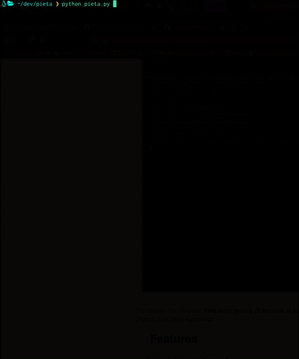
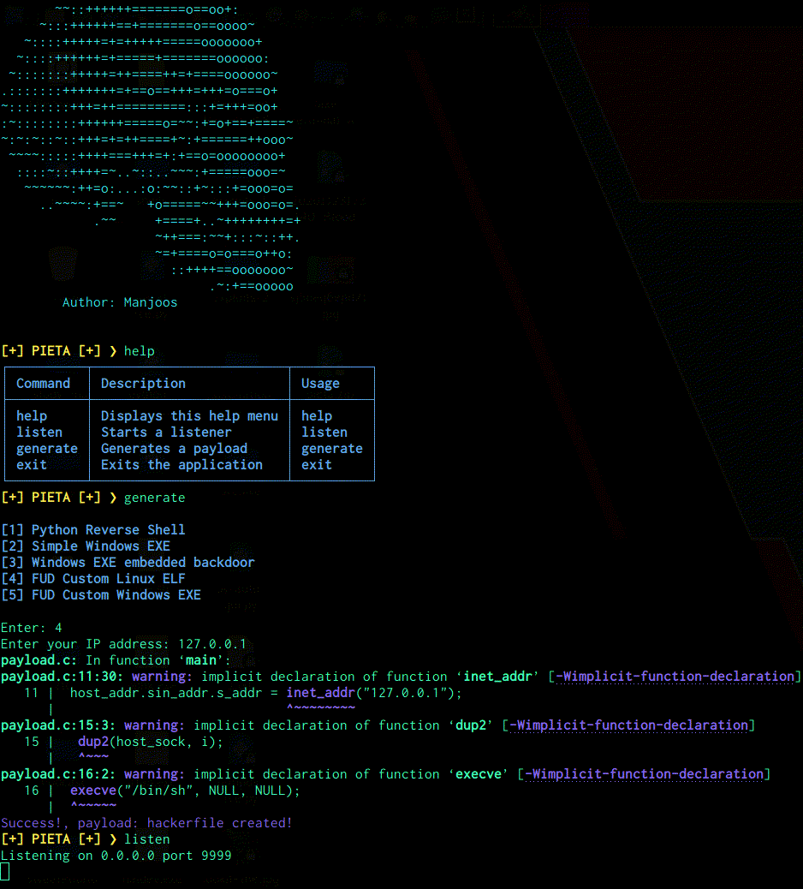
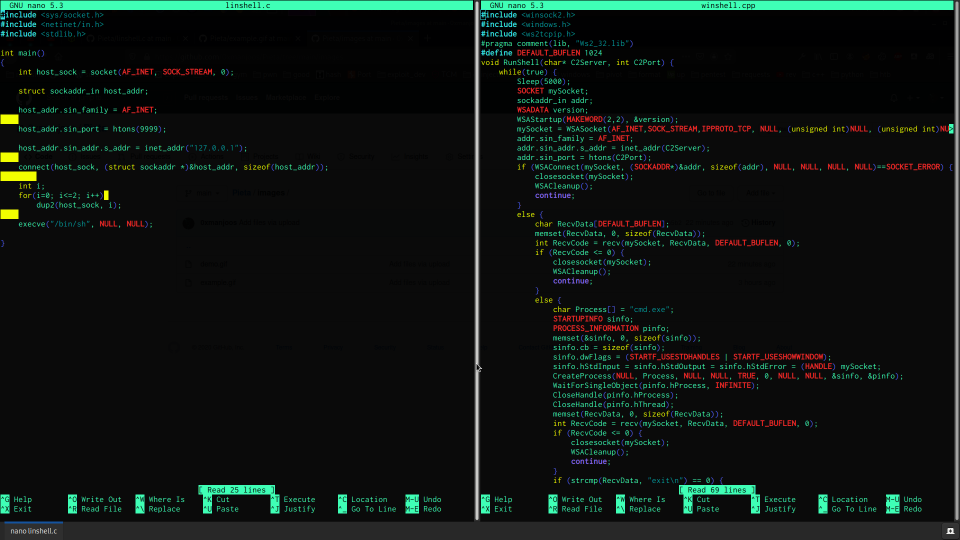

## Pieta Remote Access Tool  

NOTE: I am working on a completely revamped version of Pieta, as this is terrible code.

If you'd like to help out, reach out to me on discord at manjoos#0745

## Features:

### ⚡ Interactive Command Prompt ⚡

### ⚡ Automated Enumeration ⚡
  

### ⚡ Custom 100% FUD Payloads ⚡

### Usage: 

#### ❯ chmod +x install.sh

#### ❯ ./install.sh

#### ❯ Pieta

NOTE: I am working on a completely revamped version of Pieta, as this is terrible code. Complete shit..
